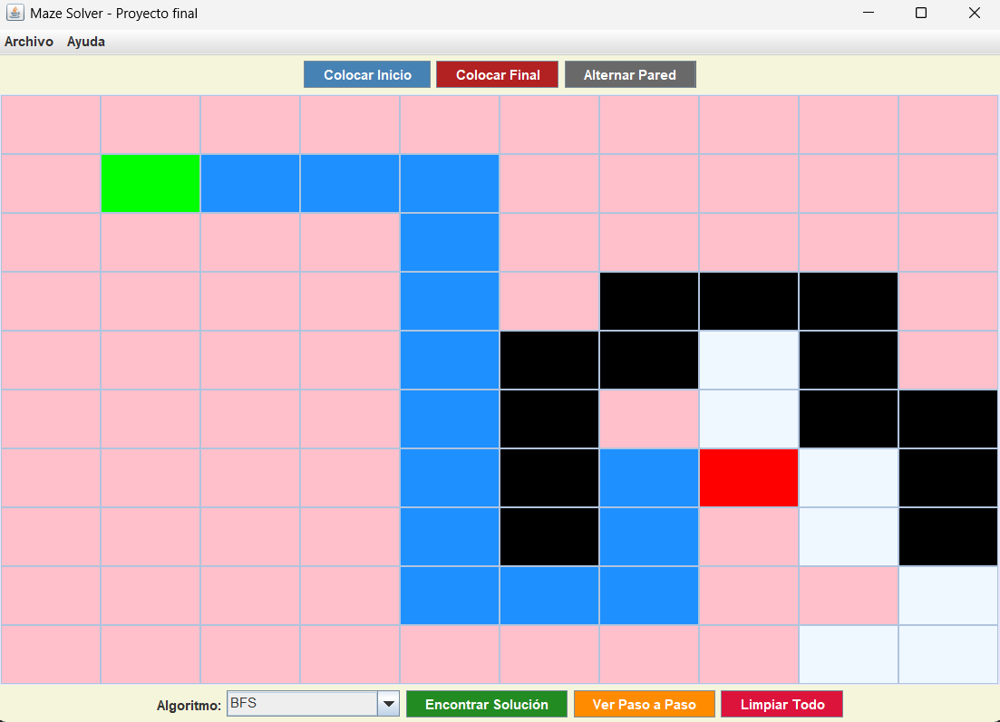
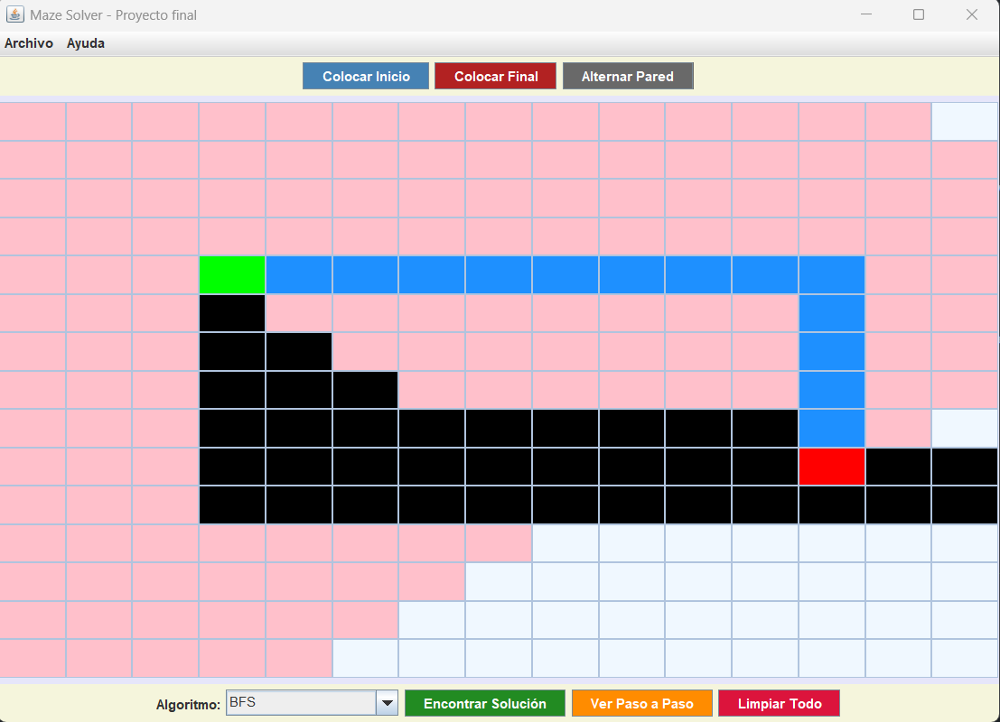

# Proyecto Final – Estructura de Datos: Resolución de Laberintos con Búsqueda y Optimización

## Universidad Politécnica Salesiana
**Materia:** Estructura de Datos  
**Estudiantes:** Esteban Vicente Pesantez Rea, Pedro Fernando Panjon Peralta, Axel David Banegas Lazo   
**Correo institucional:** epesantezr1@est.ups.edu.ec, ppanjon@est.ups.edu.ec, abanegasl@est.ups.edu.ec  

---

## Descripción del problema

Se busca resolver laberintos representados en una matriz de celdas, encontrando el camino más corto o válido desde un punto de inicio hasta un punto de salida. El proyecto debe permitir probar distintos algoritmos de búsqueda y comparar sus rendimientos, tanto en tiempo de ejecución como en longitud de la ruta.

---

## Propuesta de solución

## Marco Teórico

Se implementaron algoritmos de búsqueda y técnicas de programación fundamentales en la resolución de laberintos. A continuación se detalla cada uno:

---

### 🔍 DFS (Depth First Search – Búsqueda en Profundidad)

El algoritmo de búsqueda en profundidad es una estrategia que consiste en avanzar tanto como sea posible a lo largo de un camino antes de retroceder. Funciona utilizando una estructura de datos tipo **pila** (o recursión implícita en el stack del sistema), lo que le permite recordar los nodos visitados y retroceder cuando se encuentra un obstáculo o callejón sin salida.

Este algoritmo **no garantiza encontrar la ruta más corta**, ya que su prioridad es profundizar. Sin embargo, es eficiente para encontrar rápidamente **una** solución válida, especialmente útil en espacios grandes donde el objetivo puede estar lejos del punto de partida.

En el contexto del laberinto, DFS intenta seguir un camino desde la celda de inicio y, si llega a una celda sin salida, retrocede para probar otro camino.

---

### 🌊 BFS (Breadth First Search – Búsqueda en Anchura)

A diferencia de DFS, la búsqueda en anchura explora primero todas las celdas adyacentes al punto de inicio, luego las vecinas de esas, y así sucesivamente, expandiendo por "capas". Utiliza una estructura tipo **cola (queue)** para mantener el orden de visita, lo que garantiza que se exploren primero los caminos más cortos.

Una gran ventaja de BFS es que **siempre encuentra la ruta más corta** en laberintos no ponderados (es decir, donde cada paso cuesta lo mismo), lo que lo hace ideal para este tipo de problemas.

En este proyecto, BFS permite comparar los resultados con DFS y observar cómo los algoritmos pueden diferir en rendimiento y precisión.

---

### 🔁 Recursión

La recursión es una técnica de programación donde una función se llama a sí misma para resolver un problema más pequeño del mismo tipo. Es útil cuando la estructura del problema es naturalmente jerárquica o repetitiva, como los laberintos.

Un algoritmo recursivo sigue un patrón simple:
1. Verifica si está en una celda válida.
2. Marca la celda como parte del camino.
3. Llama a sí mismo en las celdas vecinas (arriba, abajo, izquierda, derecha).
4. Si llega a una solución, termina; si no, retrocede.

Aunque la recursión hace que el código sea más intuitivo y compacto, puede provocar problemas de **desbordamiento de pila** en laberintos muy grandes si no se maneja bien.

---

### 🔄 Backtracking (Técnica de Vuelta Atrás)

El backtracking es una extensión de la recursión que incluye la capacidad de **deshacer decisiones previas** si se descubre que no conducen a una solución válida. Es útil para problemas de tipo "probar y error", como la resolución de laberintos, sudokus o generación de combinaciones.

Su lógica general es:
- Avanza hacia una posible solución.
- Si se encuentra un obstáculo, **deshace el último paso** y prueba una alternativa.
- Continúa este proceso hasta hallar una solución o agotar todas las posibilidades.

En este proyecto, el algoritmo recursivo con backtracking explora todas las rutas posibles, pero descarta automáticamente las incorrectas, optimizando el tiempo y evitando caminos inútiles.

---

En conjunto, estos algoritmos permiten analizar la eficiencia, precisión y comportamiento de distintas estrategias al resolver el mismo problema desde perspectivas distintas.


Los algoritmos se aplican sobre una matriz de celdas (`Cell`), que puede tener distintos estados (inicio, fin, pared, camino, etc.).

### Tecnologías utilizadas

- **Lenguaje:** Java
- **Paradigma:** Programación Orientada a Objetos (POO)
- **Diseño:** Modelo-Vista-Controlador (MVC)
- **Persistencia:** Lectura/Escritura en archivo CSV (`results.csv`)
- **Interfaz gráfica:** Swing (`JFrame`, `JPanel`, `JOptionPane`)

#### 📚 Librerías externas utilizadas:

- **jcommon-1.0.24**  
  Utilizada como dependencia base para JFreeChart, provee utilidades generales como estructuras de datos, formatos de fecha y funciones gráficas.

- **jfreechart-1.5.6**  
  Librería para generar gráficos en Java. En este proyecto se emplea para **graficar los tiempos de ejecución** de cada algoritmo en una interfaz amigable. Permite crear gráficos de barras con ejes configurables, colores y etiquetas personalizadas.

### Diagrama UML
###  Parte 1  


###  Parte 2  


###  Parte 3   


## 📸 Capturas de la Interfaz

A continuación se presentan dos laberintos resueltos utilizando el mismo algoritmo de búsqueda: **BFS (Breadth-First Search)**.

### 🧩 Ejemplo 1  


### 🧩 Ejemplo 2  


---

🔍 **Ambos ejemplos fueron resueltos utilizando el algoritmo BFS (Breadth-First Search)**, el cual explora el laberinto nivel por nivel, garantizando encontrar el camino más corto desde el punto de inicio hasta el destino si existe una solución.


## Código ejemplo: Algoritmo BFS

A continuación, un fragmento comentado del algoritmo de búsqueda en anchura (BFS):

```java
package solver.solverImpl;

import java.util.*;
import models.Cell;
import models.CellState;
import models.SolveResults;
import solver.MazeSolver;

// Clase que implementa el algoritmo BFS para resolver laberintos
public class MazeSolverBFS implements MazeSolver {

    // Lista de todas las celdas que fueron procesadas/exploradas durante la búsqueda
    private List<Cell> processedCells;

    // Lista que contendrá el camino final desde el inicio hasta el destino
    private List<Cell> pathResult;

    // Matriz booleana que indica si una celda ya fue visitada
    private boolean[][] visitedGrid;

    /**
     * Punto de entrada del algoritmo. 
     * Recibe el laberinto, la celda inicial y la celda objetivo.
     * Devuelve un objeto SolveResults con el camino encontrado y las celdas procesadas.
     */
    @Override
    public SolveResults findSolution(Cell[][] maze, Cell start, Cell end) {
        // Inicializar estructuras auxiliares según el tamaño del laberinto
        initializeSearchVariables(maze.length, maze[0].length);

        // Ejecutar la búsqueda BFS desde la celda 'start' hasta la celda 'end'
        boolean pathExists = executeBreadthFirstSearch(maze, start, end);

        // Retornar los resultados: lista de celdas visitadas y el camino encontrado (si existe)
        return new SolveResults(processedCells, pathExists ? pathResult : new ArrayList<>());
    }

    /**
     * Prepara las listas y matrices necesarias antes de iniciar la búsqueda.
     */
    private void initializeSearchVariables(int rows, int cols) {
        processedCells = new ArrayList<>();
        pathResult = new ArrayList<>();
        visitedGrid = new boolean[rows][cols]; // false por defecto (ninguna celda ha sido visitada aún)
    }

    /**
     * Algoritmo principal de búsqueda en anchura (BFS).
     * Explora el laberinto nivel por nivel usando una cola FIFO.
     * Retorna true si se encontró un camino, false si no existe.
     */
    private boolean executeBreadthFirstSearch(Cell[][] maze, Cell origin, Cell target) {
        ArrayList<Cell> searchQueue = new ArrayList<>();     // Cola que mantiene las celdas por explorar
        Map<Cell, Cell> parentTracker = new HashMap<>();     // Mapa que guarda el padre de cada celda (para reconstruir el camino)

        // Agregar la celda inicial a la cola y marcarla como visitada
        searchQueue.add(origin);
        visitedGrid[origin.row][origin.col] = true;

        // Mientras haya celdas por explorar
        while (!searchQueue.isEmpty()) {
            // Extraer la siguiente celda a procesar (modo FIFO)
            Cell current = searchQueue.remove(0); 
            processedCells.add(current); // Guardar esta celda como ya procesada

            // Verificar si hemos llegado a la celda destino
            if (current.equals(target)) {
                // Reconstruir el camino desde el destino hasta el origen
                buildPathFromParents(parentTracker, origin, target);
                return true;
            }

            // Explorar las celdas vecinas válidas (arriba, derecha, abajo, izquierda)
            exploreNeighboringCells(maze, current, searchQueue, parentTracker);
        }

        // Si se terminó la búsqueda sin encontrar el destino, retornar false
        return false;
    }

    /**
     * Explora las 4 celdas vecinas cardinales (N, E, S, O).
     * Si la celda vecina es válida y no ha sido visitada, se agrega a la cola de búsqueda.
     */
    private void exploreNeighboringCells(Cell[][] maze, Cell current, ArrayList<Cell> queue, Map<Cell, Cell> parents) {
        // Direcciones: fila-columna (Norte, Este, Sur, Oeste)
        int[][] directions = {
            {-1, 0},  // Norte (arriba)
            {0, 1},   // Este (derecha)
            {1, 0},   // Sur (abajo)
            {0, -1}   // Oeste (izquierda)
        };

        // Iterar sobre cada dirección
        for (int[] dir : directions) {
            int newRow = current.row + dir[0];
            int newCol = current.col + dir[1];

            // Verificar si la celda vecina es válida y no ha sido visitada
            if (isValidMove(maze, newRow, newCol)) {
                Cell neighbor = maze[newRow][newCol];
                visitedGrid[newRow][newCol] = true;       // Marcar como visitada
                parents.put(neighbor, current);           // Registrar el padre desde el que llegamos a ella
                queue.add(neighbor);                      // Agregar a la cola para ser procesada luego
            }
        }
    }

    /**
     * Determina si una celda es válida para ser visitada:
     * - Dentro de los límites del laberinto
     * - No ha sido visitada aún
     * - No es una pared (barrera)
     */
    private boolean isValidMove(Cell[][] maze, int row, int col) {
        return row >= 0 && row < maze.length &&
               col >= 0 && col < maze[0].length &&
               !visitedGrid[row][col] &&                                // No ha sido visitada
               maze[row][col].state != CellState.BARRIER;               // No es una barrera
    }

    /**
     * Reconstruye el camino desde el destino hasta el inicio usando el mapa de padres.
     * El camino se guarda en orden correcto (inicio -> fin) en la lista pathResult.
     */
    private void buildPathFromParents(Map<Cell, Cell> parents, Cell origin, Cell target) {
        List<Cell> tempPath = new ArrayList<>();
        Cell current = target;

        // Ir hacia atrás desde el destino hasta el inicio usando el mapa de padres
        while (current != null) {
            tempPath.add(current);              // Guardar la celda actual en el camino
            current = parents.get(current);     // Moverse hacia el "padre" de esta celda
        }

        // Invertir el camino temporal y guardarlo en pathResult
        for (int i = tempPath.size() - 1; i >= 0; i--) {
            pathResult.add(tempPath.get(i));
        }
    }
}
```

## 🧠 ¿Qué hace este código?
Este código implementa el algoritmo de búsqueda en anchura (BFS - Breadth-First Search) para resolver laberintos representados como una matriz de celdas. El algoritmo explora el laberinto nivel por nivel, utilizando una cola para visitar las celdas más cercanas primero. A medida que recorre el laberinto, registra las celdas procesadas y reconstruye el camino más corto desde el punto de inicio hasta el destino, si existe una solución válida.


## Conclusiones
Después de comparar los cinco algoritmos en distintos escenarios de recorrido y búsqueda en estructuras tipo matriz, considero que el algoritmo BFS (Breadth-First Search) es el más óptimo en términos de eficiencia y cobertura sistemática. A diferencia de los métodos recursivos y DFS, BFS garantiza encontrar la solución más corta (camino mínimo) cuando existe, y evita ciclos o caminos redundantes al trabajar con una cola y registros de nodos visitados.Los métodos recursivos (especialmente sin backtracking) tienen dificultades con estructuras más complejas, ya que pueden causar desbordamientos de pila o perder soluciones óptimas. El backtracking mejora esa limitación, pero sigue siendo menos eficiente comparado con BFS. DFS tiene la ventaja de menor uso de memoria pero no garantiza caminos óptimos, lo que puede ser problemático dependiendo del objetivo. (Axel Banegas).  


En base al proyecto realizado, se puede considerar que el algoritmo BFS es el más óptimo para encontrar el camino más corto, ya que explora los nodos por niveles y garantiza obtener la solución en la menor cantidad de pasos. No obstante, también se destaca el DFS, que, si bien no siempre asegura la ruta más corta, presenta un menor consumo de memoria RAM, lo que lo hace más eficiente en escenarios donde la optimización de recursos es prioritaria. Los algoritmos recursivos de 2 y 4 direcciones, junto con su variante con backtracking, son útiles para comprender la lógica de búsqueda y resolver problemas simples, aunque su rendimiento disminuye en laberintos o grafos de mayor tamaño debido a la gran cantidad de llamadas recursivas. (Pedro Panjon).  


El algoritmo Recursivo Completo es el más óptimo debido a su capacidad de explorar sistemáticamente todas las direcciones posibles (arriba, abajo, izquierda, derecha) mientras mantiene una estructura recursiva eficiente y elegante. Su diseño permite una búsqueda exhaustiva del espacio de soluciones sin requerir estructuras de datos adicionales complejas como colas o pilas explícitas, aprovechando directamente la pila de llamadas del sistema para gestionar el estado de la búsqueda. Esta aproximación garantiza que se encuentre una solución válida cuando esta exista, mientras que su naturaleza recursiva facilita la implementación y el mantenimiento del código. Además, el algoritmo demuestra una excelente capacidad de adaptación a diferentes configuraciones de laberinto, ya que su exploración en cuatro direcciones le permite navegar eficientemente tanto en espacios abiertos como en corredores estrechos, manteniendo un control preciso sobre el camino recorrido y evitando ciclos infinitos mediante el marcado adecuado de las celdas visitadas. (Esteban Pesantez).


## Recomendaciones y aplicaciones futuras
Recomiendo usar BFS para búsquedas donde se requiere la mejor solución en cuanto a distancia, como en laberintos, mapas o grafos con pesos homogéneos. Para problemas donde la profundidad y complejidad del espacio de soluciones es muy alta, explorar algoritmos como A* o Dijkstra sería ideal, ya que permiten optimizar aún más el recorrido en grafos con pesos variables. Además, en futuros proyectos o simulaciones, podría combinarse DFS con backtracking para juegos tipo puzzle donde todas las posibles soluciones deben ser exploradas. Los algoritmos recursivos simples pueden servir como introducción didáctica, pero no se recomiendan en implementaciones robustas. (Axel Banegas).  


Se recomienda emplear BFS en proyectos donde la prioridad sea garantizar la ruta más corta, como en sistemas de navegación, videojuegos que requieran búsqueda eficiente y aplicaciones de evacuación. DFS resulta apropiado en exploraciones completas y generación de laberintos, donde el uso eficiente de memoria es más importante que la optimización del trayecto. Para futuras aplicaciones, se sugiere investigar algoritmos avanzados como A* y Dijkstra, que combinan eficiencia y heurísticas para mejorar tiempos de búsqueda, así como desarrollar implementaciones híbridas que integren las ventajas de BFS y DFS. Además, optimizar las estructuras de datos y adaptar los algoritmos a escenarios de gran escala permitirá un mejor desempeño en entornos complejos y dinámicos. (Pedro Panjon).


Se recomienda implementar el algoritmo Recursivo Completo para aplicaciones de navegación en robótica autónoma, especialmente en entornos industriales y domésticos donde los robots necesitan planificar rutas óptimas para el transporte de materiales, limpieza automatizada o exploración de espacios desconocidos. Su robustez y simplicidad conceptual lo convierten en una solución confiable para sistemas que requieren pathfinding en tiempo real con recursos computacionales limitados. También resulta ideal para el desarrollo de videojuegos donde se necesita implementar sistemas de navegación para personajes no jugables, aplicaciones educativas de programación, y como base para algoritmos más complejos en proyectos de inteligencia artificial donde la comprensión del comportamiento fundamental de búsqueda es crucial. (Esteban Pesantez).
